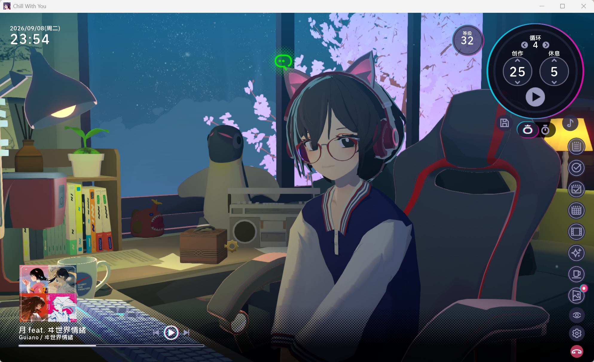

# ChillPatcherLite
[简体中文](README.md) | [English](README_EN.md) | [日本語](README_JA.md)

[](https://www.gnu.org/licenses/gpl-3.0)
[](https://dotnet.microsoft.com/download/dotnet-framework/net472)
[](https://github.com/BepInEx/BepInEx)

从 [ChillPatcher](https://github.com/BeyondtheApex/ChillPatcher)拆出来用于游戏《放松时光：与你共享Lo-Fi故事》的 BepInEx 插件：**更改UI布局，增大音乐封面**

---

[](https://store.steampowered.com/app/3548580/)

> 「放松时光：与你共享Lo-Fi故事」是一个与喜欢写故事的女孩聪音一起工作的有声小说游戏。您可以自定义艺术家的原创乐曲、环境音和风景，以营造一个专注于工作的环境。在与聪音的关系加深的过程中，您可能会发现与她之间的特别联系。
---
## 效果演示：



从 [ChillPatcher](https://github.com/BeyondtheApex/ChillPatcher) **V1.3.4.1**
中移植出来的两个 UI 功能，大佬改的UI界面特别好看，但是后面mod功能超级多太复杂了，就把我最喜欢的这个拆出来做了个轻量版

播放音乐的话我用的 [Chill Music Information Sync (音乐信息同步)](https://github.com/Cainongw/ChillMusicInformationSyncMod) 同步网易云的音乐，感觉更方便一些，兼容性这边也已经做好适配了

## 安装步骤

### 前置环境要求

- 游戏《放松时光：与你共享Lo-Fi故事》
- [BepInEx 5.x](https://github.com/BepInEx/BepInEx/releases)（请勿使用 6.0）

### 步骤
1. **安装 BepInEx**
* 从上方链接下载 BepInEx。
* 解压至游戏根目录。
* 运行一次游戏以生成 BepInEx 相关文件夹（能看到 `[游戏根目录]/BepInEx/plugins/`）。

2. **安装 Mod**
* 从 Release 下载最新版本的 `ChillPatcherLite.dll`。
* 将 `ChillPatcherLite.dll` 放入`BepInEx/plugins/` 目录下。
* 确保你的文件夹结构如下所示：


```
[游戏根目录]/
└── BepInEx/
    └── plugins/
            └── ChillPatcherLite.dll
```

## 关于其他Mod

如果您对此游戏其他Mod感兴趣，可参见：[awesome-chillwithyou](https://github.com/clsty/awesome-chillwithyou)


## 许可与致谢

- 移植自 [ChillPatcher](https://github.com/BeyondtheApex/ChillPatcher)
  V1.3.4.1，作者 [BeyondtheApex](https://github.com/BeyondtheApex)。
- 原项目与本文档派生代码按 **GPL-3.0** 授权，请保留版权与许可声明。
- 本插件仅供学习交流，请支持正版游戏。
